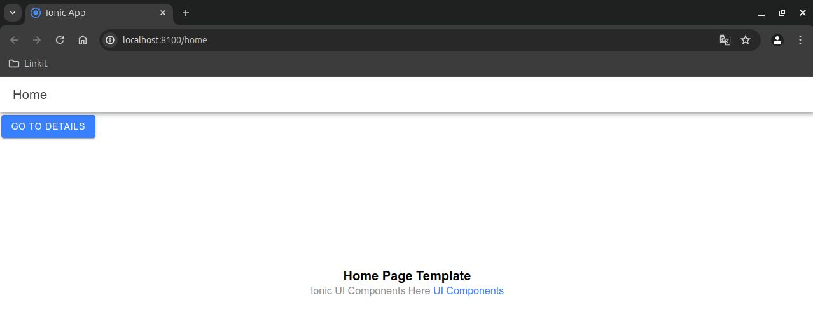
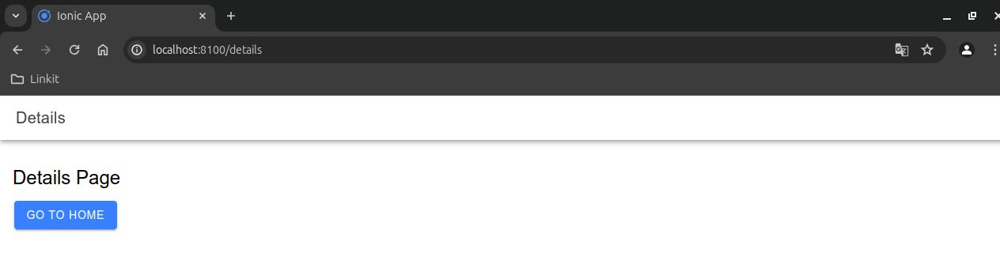

# Getting Started with Ionic React App

This is a project template for constructing a web page.

### Quick Start

```sh
ionic start myIonicReactApp blank --type=react
```
```sh
cd myIonicReactApp
```
```sh
npm install @ionic/react@latest @ionic/react-router@latest @ionic/core@latest
```
```sh
ionic serve
```


